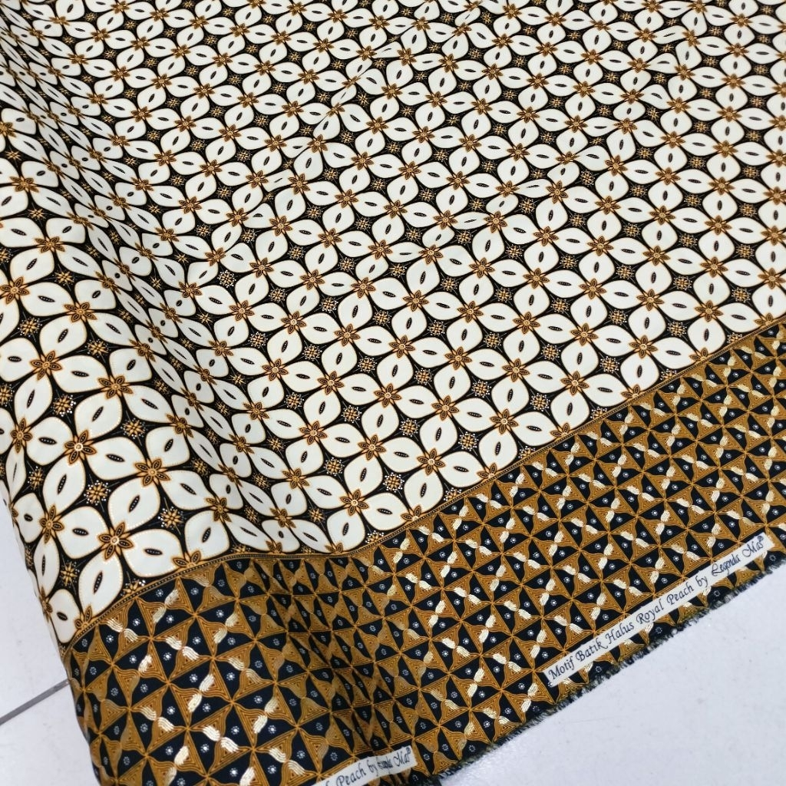

# Batik Nusantara - Landing Page Toko Batik

README ini menjelaskan sistem landing page statis untuk toko Batik Nusantara. Aplikasi ini dibuat sebagai halaman promosi dan katalog sederhana yang menampilkan koleksi batik, informasi brand, program kemitraan, keranjang belanja, dan checkout melalui WhatsApp.

## Gambaran Sistem

Batik Nusantara adalah website satu halaman atau single page landing page. Seluruh tampilan utama berada di `index.html`, styling utama menggunakan Tailwind CSS CDN, dan interaksi pengguna diatur oleh JavaScript lokal pada `assets/js/script.js`.

Website ini tidak menggunakan backend, database, framework JavaScript, atau proses build. Data produk saat ini ditulis langsung di HTML melalui atribut `data-*` pada tombol tambah keranjang. Saat pengguna melakukan checkout, sistem membuat ringkasan pesanan dan membuka WhatsApp dengan pesan yang sudah terisi otomatis.

## Fitur Utama

- Navbar responsif untuk desktop dan mobile.
- Hero section dengan gambar utama, headline, dan tombol navigasi.
- Katalog produk batik dengan gambar, kategori, harga, label produk, dan tombol tambah ke keranjang.
- Drawer keranjang belanja di sisi kanan halaman.
- Badge jumlah item pada ikon keranjang desktop dan mobile.
- Penambahan kuantitas produk jika produk yang sama dimasukkan ulang.
- Kontrol tambah, kurang, dan hapus item di keranjang.
- Perhitungan total belanja otomatis dalam format Rupiah.
- Checkout WhatsApp dengan daftar produk, jumlah, subtotal, dan total belanja.
- Toast notification setelah produk berhasil masuk keranjang.
- Scroll reveal untuk elemen yang masuk viewport.
- Form newsletter sederhana dengan validasi email dasar.
- Section keunggulan, tentang brand, kemitraan, kontak, dan footer.

## Teknologi yang Digunakan

- HTML5 untuk struktur halaman.
- Tailwind CSS CDN untuk utility styling dan responsive layout.
- JavaScript vanilla untuk semua interaksi.
- Font Awesome CDN untuk ikon.
- Google Fonts untuk font `Inter` dan `Merriweather`.
- Asset lokal pada folder `assets/img`.

Karena Tailwind, Font Awesome, dan Google Fonts dimuat dari CDN, tampilan penuh membutuhkan koneksi internet saat halaman dibuka.

## Struktur Folder

```text
toko-batik-v2/
|-- README.md
|-- index.html
`-- assets/
    |-- css/
    |   `-- style.css
    |-- img/
    |   |-- header.png
    |   |-- membatik.png
    |   |-- motif1.png
    |   `-- produk/
    |       |-- dress.png
    |       |-- image.png
    |       |-- kain-sutra.png
    |       `-- megemendung.png
    `-- js/
        `-- script.js
```

## Penjelasan File

### `index.html`

File utama website. Berisi struktur lengkap halaman, konfigurasi Tailwind CDN, link font dan ikon, daftar section, data produk, drawer keranjang, toast notification, form newsletter, dan pemanggilan script lokal.

Bagian penting di dalam file ini:

- `tailwind.config`: konfigurasi warna, font, dan shadow custom.
- `nav#navbar`: navbar desktop dan mobile.
- `#mobile-menu`: menu mobile yang dibuka melalui tombol hamburger.
- `#cart-drawer`: panel keranjang belanja.
- `#cart-backdrop`: overlay saat keranjang dibuka.
- `#toast-notification`: notifikasi setelah produk masuk keranjang.
- `section#beranda`: hero section.
- `section#koleksi`: katalog produk.
- `section#keunggulan`: nilai atau keunggulan toko.
- `section#tentang`: kisah brand dan pengrajin.
- `section#kerjasama`: program reseller, dropship, B2B, dan souvenir.
- `footer#kontak`: informasi kontak, sosial media, dan newsletter.

### `assets/js/script.js`

File JavaScript utama untuk logika interaktif halaman.

Fungsi utama yang ditangani:

- Mengubah tampilan navbar saat halaman discroll.
- Membuka dan menutup menu mobile.
- Menjalankan animasi reveal berbasis `IntersectionObserver`.
- Menyimpan state keranjang dalam array `cartItems`.
- Membuka dan menutup drawer keranjang.
- Menambahkan produk ke keranjang dari tombol `.add-to-cart-btn`.
- Mengubah kuantitas produk di keranjang.
- Menghapus produk dari keranjang.
- Menghitung total item dan total harga.
- Membuat pesan checkout WhatsApp.
- Membuka link WhatsApp melalui `window.open`.
- Menangani submit form newsletter secara lokal.

### `assets/css/style.css`

File CSS tambahan untuk styling custom di luar Tailwind. Saat ini file ini masih kosong, tetapi HTML dan JavaScript sudah memakai beberapa class custom seperti:

- `hero-gradient`
- `text-gradient-gold`
- `pattern-bg`
- `img-zoom-container`
- `reveal`
- `reveal-delay-1`
- `reveal-delay-2`
- `reveal-delay-3`
- `cart-drawer-open`
- `backdrop-open`
- `toast-animate`

Jika efek visual seperti gradient hero, pattern background, reveal animation, drawer open state, atau toast animation belum terlihat, definisi CSS untuk class tersebut perlu ditambahkan ke file ini.

## Alur Kerja Pengguna

1. Pengguna membuka halaman `index.html`.
2. Pengguna melihat hero section dan navigasi utama.
3. Pengguna menuju section `Koleksi`.
4. Pengguna menekan tombol tambah keranjang pada produk.
5. Sistem membaca data produk dari atribut `data-id`, `data-name`, `data-price`, dan `data-img`.
6. Produk disimpan ke array `cartItems`.
7. Jika produk sudah ada di keranjang, sistem menambah `qty`.
8. UI keranjang, badge jumlah item, dan total harga diperbarui.
9. Drawer keranjang terbuka dan toast notifikasi muncul.
10. Pengguna bisa menambah, mengurangi, atau menghapus item.
11. Pengguna menekan tombol `Chat Penjual via WA`.
12. Sistem membuat teks pesanan otomatis dan membuka WhatsApp admin.

## Data Produk Saat Ini

Produk ditulis langsung di `index.html` pada section `#koleksi`.

| ID | Nama Produk | Harga | Kategori |
| --- | --- | ---: | --- |
| PRD-001 | Kemeja Tulis Megamendung | Rp 450.000 | Pakaian Pria |
| PRD-002 | Dress Midi Parang Kusumo | Rp 525.000 | Pakaian Wanita |
| PRD-003 | Kain Sutra Kawung (2M) | Rp 850.000 | Kain Lembaran |

Contoh struktur tombol produk:

```html
<button
    class="add-to-cart-btn"
    data-id="PRD-001"
    data-name="Kemeja Tulis Megamendung"
    data-price="450000"
    data-img="assets/img/produk/megemendung.png">
    Tambah ke Keranjang
</button>
```

Catatan: pada file saat ini, atribut `data-img` tombol produk menggunakan URL gambar dari Unsplash untuk thumbnail di keranjang, sedangkan gambar kartu produk menggunakan asset lokal. Jika ingin keranjang sepenuhnya memakai asset lokal, ubah nilai `data-img` menjadi path lokal seperti `assets/img/produk/megemendung.png`.

## Konfigurasi WhatsApp

Nomor WhatsApp admin untuk checkout diatur di `assets/js/script.js`:

```js
const ADMIN_WA_NUMBER = "6281234567890";
```

Gunakan format internasional tanpa tanda `+`. Contoh untuk nomor Indonesia:

```js
const ADMIN_WA_NUMBER = "6281234567890";
```

Tombol kemitraan di section `#kerjasama` juga memiliki link WhatsApp langsung di `index.html`:

```html
https://wa.me/6281234567890?text=...
```

Jika nomor admin diganti, ubah kedua tempat tersebut agar konsisten.

## Cara Menjalankan

Karena proyek ini adalah website statis, tidak perlu instal dependency.

Cara paling sederhana:

1. Buka folder proyek.
2. Buka file `index.html` langsung di browser.

Alternatif saat pengembangan:

1. Gunakan ekstensi Live Server di VS Code.
2. Klik kanan `index.html`.
3. Pilih `Open with Live Server`.

Jika memakai server lokal lain, cukup arahkan root server ke folder proyek ini.

## Cara Mengubah Konten

### Mengubah teks website

Edit langsung teks pada `index.html`, misalnya headline hero, deskripsi produk, section tentang, alamat, email, dan footer.

### Mengubah gambar

Simpan gambar baru di folder `assets/img` atau `assets/img/produk`, lalu ubah atribut `src` pada elemen `` di `index.html`.

Contoh:

```html

```

### Menambah produk

Untuk menambah produk:

1. Duplikasi salah satu kartu produk di section `#koleksi`.
2. Ubah gambar, nama, kategori, harga, dan label.
3. Pastikan tombol memiliki class `add-to-cart-btn`.
4. Isi atribut `data-id`, `data-name`, `data-price`, dan `data-img`.
5. Gunakan `data-id` yang unik agar kuantitas tidak tercampur dengan produk lain.

### Mengubah warna brand

Warna utama diatur pada konfigurasi Tailwind dalam `index.html`:

```js
colors: {
    'batik-primary': '#4A2511',
    'batik-secondary': '#FAFAF8',
    'batik-accent': '#C5A059',
    'batik-dark': '#1A0F08',
}
```

Ubah nilai hex sesuai kebutuhan brand.

## Detail Logika Keranjang

State keranjang hanya hidup selama halaman dibuka:

```js
let cartItems = [];
```

Artinya:

- Keranjang akan kosong kembali jika halaman direfresh.
- Data tidak tersimpan ke `localStorage`.
- Data tidak dikirim ke server.
- Checkout hanya membuat pesan WhatsApp dari state yang sedang aktif.

Format data item di keranjang:

```js
{
    id: "PRD-001",
    name: "Kemeja Tulis Megamendung",
    price: 450000,
    img: "...",
    qty: 1
}
```

Perhitungan total:

```js
const totalPrice = cartItems.reduce((acc, item) => acc + (item.price * item.qty), 0);
```

Format harga memakai `Intl.NumberFormat` dengan locale `id-ID` dan currency `IDR`.

## Pesan Checkout WhatsApp

Saat checkout, sistem membuat pesan seperti berikut:

```text
Halo *Batik Nusantara*, saya ingin memesan:

1. *Kemeja Tulis Megamendung*
    Jumlah: 1 pcs
    Harga: Rp 450.000

*Total Belanja: Rp 450.000*
(Belum termasuk ongkir)

Tolong bantu cek ketersediaan stoknya ya kak. Terima kasih!
```

Pesan tersebut di-encode dengan `encodeURIComponent`, lalu dibuka melalui URL:

```js
https://wa.me/{ADMIN_WA_NUMBER}?text={encodedText}
```

## Responsive Design

Website sudah menggunakan utility class Tailwind untuk tampilan responsif:

- Mobile memakai tombol hamburger dan menu overlay.
- Desktop menampilkan menu horizontal.
- Grid produk berubah dari 1 kolom ke 2 kolom dan 3 kolom sesuai ukuran layar.
- Section utama memakai `max-w-7xl` agar konten tetap terbaca di layar besar.

## Dependensi Eksternal

Dependensi yang dimuat dari internet:

- Tailwind CSS: `https://cdn.tailwindcss.com`
- Font Awesome: `https://cdnjs.cloudflare.com/ajax/libs/font-awesome/6.4.0/css/all.min.css`
- Google Fonts: `https://fonts.googleapis.com`
- Beberapa fallback gambar memakai `https://placehold.co`
- Thumbnail keranjang produk saat ini memakai URL Unsplash pada atribut `data-img`

Untuk deployment produksi yang lebih stabil, pertimbangkan memindahkan dependency penting ke asset lokal atau memakai proses build Tailwind.

## Batasan Sistem Saat Ini

- Belum ada backend atau database.
- Keranjang belum tersimpan setelah refresh halaman.
- Belum ada halaman detail produk.
- Belum ada validasi stok.
- Belum ada kalkulasi ongkir.
- Belum ada integrasi payment gateway.
- Form newsletter hanya validasi lokal dan belum mengirim data ke server.
- File `assets/css/style.css` masih kosong, padahal beberapa class custom sudah dipakai oleh HTML dan JavaScript.

## Rekomendasi Pengembangan Lanjutan

- Tambahkan CSS custom untuk class animasi dan drawer state di `assets/css/style.css`.
- Simpan keranjang ke `localStorage` agar tidak hilang saat refresh.
- Pindahkan data produk ke file JSON agar lebih mudah dikelola.
- Tambahkan halaman detail produk atau modal preview.
- Tambahkan filter kategori dan pencarian produk.
- Tambahkan integrasi backend untuk stok, pesanan, dan newsletter.
- Optimalkan asset gambar agar ukuran file lebih ringan.
- Gunakan Tailwind build process untuk production agar CSS lebih kecil dan tidak bergantung pada CDN.

## Deployment

Karena proyek ini statis, website dapat dihosting di layanan static hosting seperti:

- GitHub Pages
- Netlify
- Vercel
- Cloudflare Pages
- Hosting biasa berbasis cPanel

Pastikan struktur folder tetap sama agar path asset seperti `assets/img/header.png` dan `assets/js/script.js` tetap terbaca.
